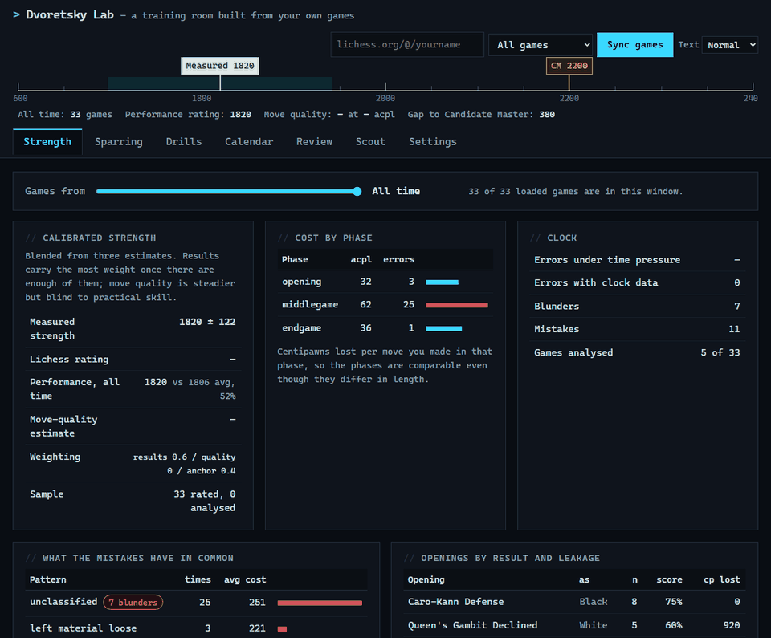

# Dvoretsky Lab

[](https://github.com/luke-zhang-cs-py/Dvoerstky-AI-Chess-Coach/actions/workflows/tests.yml)
[](LICENSE)
[](#run-it)

Why do *you* keep losing? A chess training room built from one player's own games:
an opponent that plays like you, drills cut from your own mistakes, and Stockfish
grading every move.

### ▶ [Try it now — runs in your browser, nothing to install](https://luke-zhang-cs-py.github.io/Dvoerstky-AI-Chess-Coach/)



*Above: the analysis window narrowing from all time to 30 days, then a sparring game
against the mirror. It answers from the player's own repertoire, and Stockfish grades
every move as it lands. Recorded from the live page by
[`tools/record_demo.py`](tools/record_demo.py).*

**[Read the full guide →](notes/GUIDE.md)** — every tab, every number and where it
comes from.

## Run it

Double-click `index.html`. That's it: no server, no build, no account. Then put a
Lichess username in the box, pick **All games** or one format, and press **Sync
games** (or import a PGN in Settings).

```bash
python tools/build_single_file.py     # one self-contained HTML file, Stockfish included
```

## Two engines, on purpose

| | the house engine (`js/engine.js`) | Stockfish 10 (`js/vendor/`) |
|---|---|---|
| job | the sparring opponent, the drills, live advice | the check on all of that |
| strength | club level, on purpose, so it can be tuned to *your* error rate | far stronger |
| search | alpha-beta, quiescence, transposition table, null-move pruning | Stockfish's |
| runs | on the page | in a Web Worker, from a Blob, because `file://` blocks the usual way |

The mirror's moves are chosen to lose centipawns at the rate *you* lose them.
Stockfish then measures what each move really cost, so the panel shows whether the
house engine judged its own mistakes correctly.

## Layout

```
index.html   the whole app: open it
js/          ten modules, plain scripts, no bundler; js/vendor/ is Stockfish (GPL-3.0)
css/         one stylesheet
test/        Node suites, a Playwright drive of the page, and a coverage report
tools/       the single-file build and the demo recorder
experiments/ a PyTorch move predictor and an Elo study against Stockfish, apart from the app
notes/       the full guide
```

## Tests

**68 regression checks, 39 rules checks, 37 titled-player checks, 56 browser checks, and perft on 21
positions**, 15 of them edge cases (en passant out of a pin, castling into check,
underpromotion) with counts taken from Stockfish 19. Every bug fixed has a check that
failed on the code before its fix. The browser checks run the real Stockfish.

**From the outside** (`test/engine_gauntlet.py`): the engine driven over UCI the way a
GUI drives it, with python-chess as a referee that shares no code with `js/core.js`.

| check | result |
|---|---|
| legality: 1,000 positions (random games, EPD suites, random valid placements, 18 edge cases) plus 2 game-over positions | 1,002 of 1,002 legal, well-formed and on time; median 83 ms, slowest 99 ms at 100 ms a move |
| mate in 1: 100 positions, screened by Stockfish and proved by brute force | 100 of 100 at 1 s |
| mate in 2: 100 positions, any forced line accepted | 100 of 100 at 1 s |
| 100 games against a random mover, 50 against a greedy capturer | 150 wins, no draws, no freezes, no games run to the ply cap; median win in 31 plies |
| 20 games against Stockfish 19 at 0.1 s a move (house engine also 0.1 s) | 0.5 of 20 (one perpetual), as expected. Median first blunder (200+ cp by a depth-12 referee) at move 8 after the opening; really down material from move 14 |

On Windows the harness switches off power throttling for the engines it starts: a
windowless child otherwise runs at about half speed (66k against 127k nodes/s here),
and mate in 2 fell to 95–97 of 100 because depth 3 no longer fit in the second.

| strength | |
|---|---|
| matches against Stockfish 19 (set to 1500, 1800, 2100) and Maia 1500, 1900 (`tools/match.js`, 30+0.3) | performance about 1730 over 66 games |
| SPRT against the previous engine (`tools/sprt.js`) | +41 ± 28 Elo, H1 accepted |
| Win at Chess, 300 tactics (`test/tactics.js`) | 87 at 0.5 s |
| Bratko-Kopec, 24 positions | 6 at 10 s |
| BT2630, 30 hard positions | 3 at 10 s: a rating floor of 1820 |
| STS, 1,500 strategic positions | 41.9% of the points at 0.5 s |
| speed (`test/bench.js`) | 60–110k nodes/s, by machine load; perft 3.4M leaves/s |

Stockfish 19 through the same suites and scorer: WAC 276 at 1 s, Bratko-Kopec 20, BT2630
24, STS 86.2%, so the answer keys and the scoring hold up.

`test/stockfish_check.py` re-checks the app's claims against Stockfish 19: every
endgame study's verdict, the imported evaluations, the mined mistakes and the house
engine's own choices (93% within 50 cp of best). `tools/uci.js` runs the engine in
any UCI GUI. Setup: [`.github/CONTRIBUTING.md`](.github/CONTRIBUTING.md).

MIT, except `js/vendor/` (Stockfish.js, GPL-3.0).
